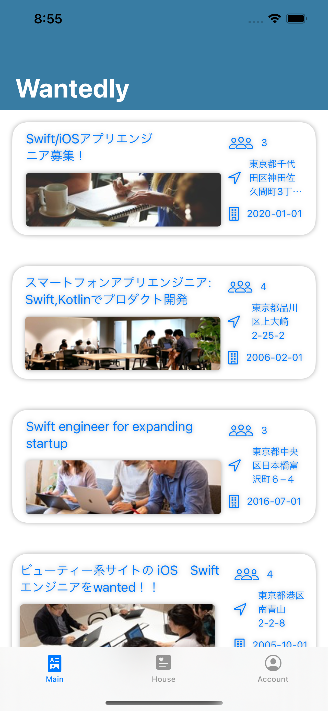
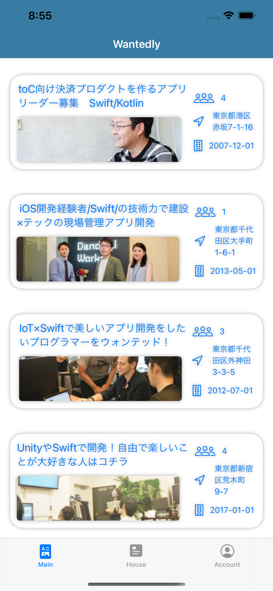
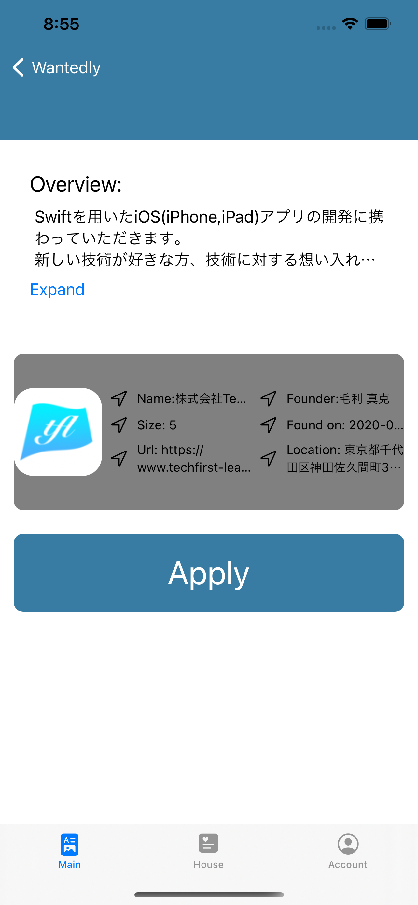
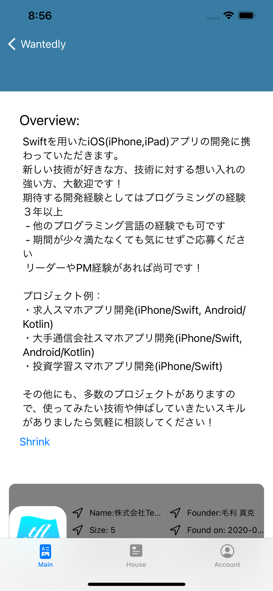
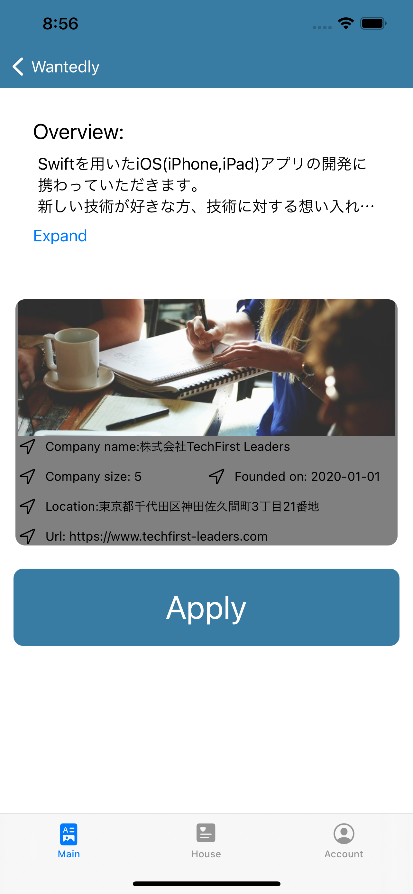

#  Wantedlt_Test Project

| Main page initial state    | Main page scroll down state|Card detail page initial state| Card detail page job overview expand state
| -------------------------- | -------------------------- | -------------------------- | -------------------------- |
|   |   |  |  |
| Card detail page company overview expanded state| _ | _  | _ |
|   | _ | _  | _ |

## Feature
- Implemented with SwiftUI.
- Scrollable layout of Page 1 of the Wantedly Job Publisher API.
- Detail View for each Job

## Note
- Two dummy tabviews are added(Dummy1, Dummy2) to make the UI look more cordinated 
- Apply button serves no purpose, only prints "Dummy button" in console

